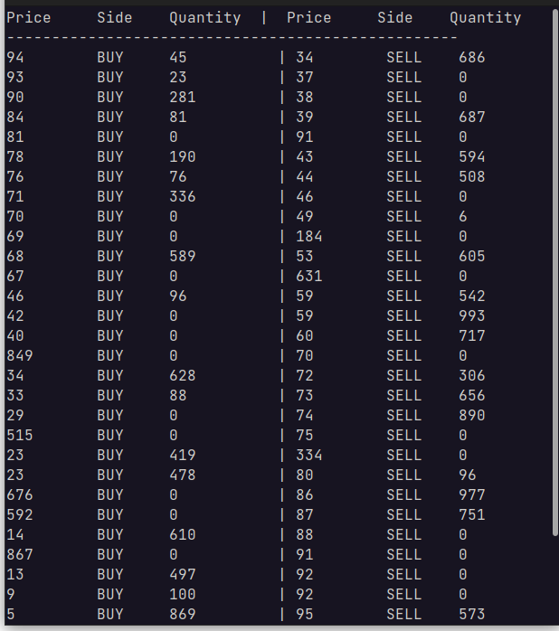

# Orderbook

Implementation of a simple orderbook in  python.

## Features
- Supports order types like market,limit,stop
- Order pushing to orderbook
- Order Matching
- Order cancellation/modification
- Order book display on terminal
- Handling market illiquidity





## Setup (for Ubuntu)
- Clone and enter the repository directory
  ```
  git clone repository_url
  cd \path\to\repository_directory
  ```

- Run tests
  ```
  python3 tests.py
  ```
